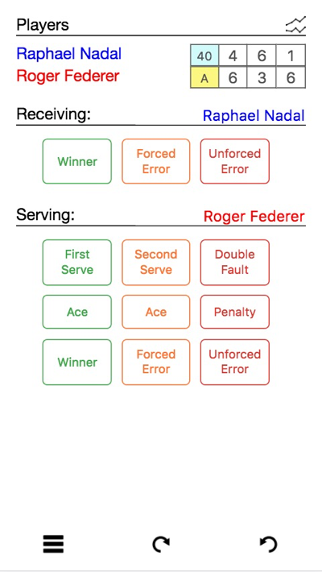

## CourtHive mobile

CourtHive mobile is a free/open source [Progressive Web App](https://en.wikipedia.org/wiki/Progressive_web_app) for tracking tennis matches. It can be saved to the home screen of your mobile device and behaves almost like a native app.

While primarily built as a framework for exercising the [Universal Match Object](https://github.com/TennisVisuals/universal-match-object), CourtHive also supports the idea that there are both many possible ways to track a tennis match, and many different attributes that could possibly be tracked... I have provided three initial views, or 'skins', and plan to develop more in the future. Of course I welcome any and all suggestions!

Full stats are generated as well:

In the future the full complement of match visualizations currently hosted on [TennisVisuals.com](http://tennisvisuals.com:8080) will be rolled into CourtHive mobile.
