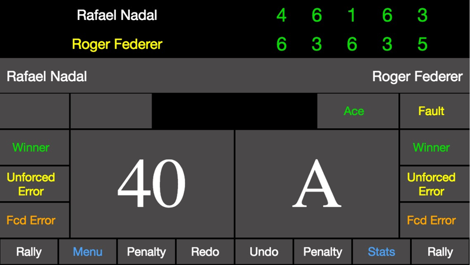
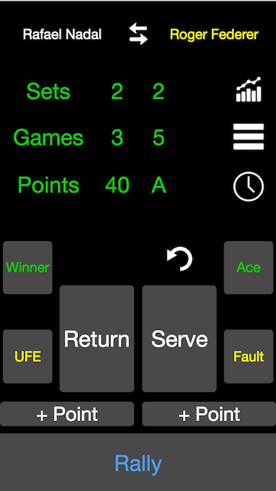
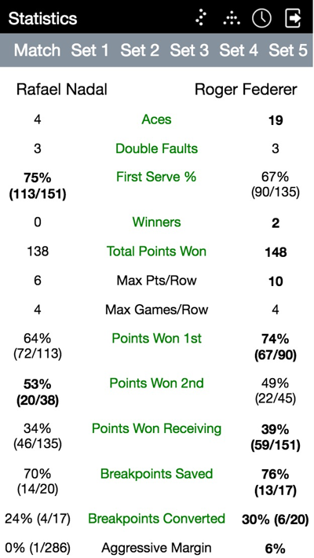
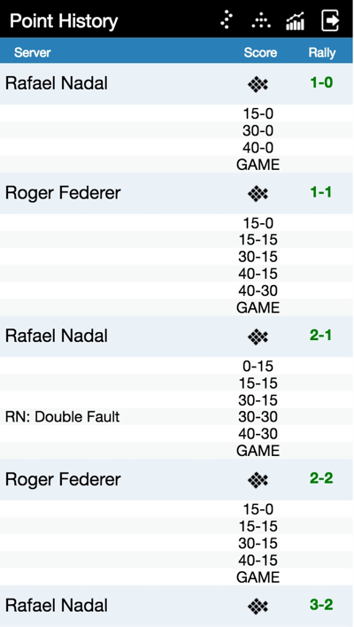

## CourtHive mobile

[CourtHive mobile](http://tennisvisuals.com:8080/CourtHive/mobile/) is a free/open source [Progressive Web App](https://en.wikipedia.org/wiki/Progressive_web_app) for tracking tennis matches. It can be saved to the home screen of your mobile device and behaves almost like a native app.

[CourtHive mobile](http://tennisvisuals.com:8080/CourtHive/mobile/) has been successfully tested on iPhones 5, 6, and 7, as well as with a **Chrome** browser on several devices running Android > 5.  CourtHive *will not* load with the default Android browser. At present iOS 10 is required on Apple devices, so older iPhones and iPads cannot run the code without modification/transpiling.

While primarily built as a framework for exercising the [Universal Match Object](https://github.com/TennisVisuals/universal-match-object), CourtHive supports the idea that there are both many possible ways to track a tennis match, and many different attributes that could possibly be tracked... I have provided three initial views, or 'skins', and plan to develop more in the future. Of course I welcome any and all suggestions!

[CourtHive mobile](http://tennisvisuals.com:8080/CourtHive/mobile/) produces full stats as well as some very basic charts as an example of integrating [D3js](https://d3js.org/) visualizations. In the future the full complement of match visualizations currently hosted on [TennisVisuals.com](http://tennisvisuals.com:8080) will be rolled into CourtHive mobile.

